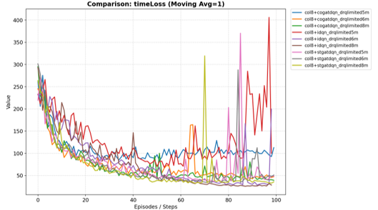
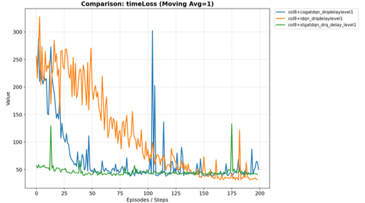
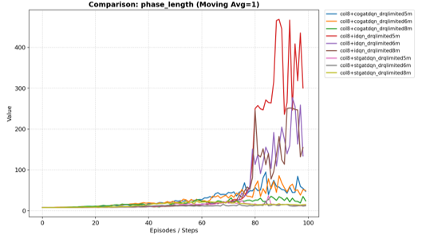

# RL-Traffic-Signal-Control: Robust TSC under Partial Visibility & Latency

本專案旨在解決強化學習 (RL) 應用於交通號誌控制 (Traffic Signal Control, TSC) 時，因感測器物理限制所造成的「視野受限 (Partial Visibility)」與「資訊延遲 (Information Latency)」問題。我們提出了一種具備時間與空間感知能力的創新架構 **STGATDQN**，顯著提升了模型在不完美觀察條件下的強健性。

##  研究動機與痛點 (Motivation)
在現實世界的交通場景中，理想的全域觀察（Global Observation）難以達成。感測器可能因遮蔽物導致視角有限，或因網路傳輸造成資料延遲。現有的頂尖模型在這些「干擾環境」下往往表現不佳，容易產生過度擬合或無效決策。

##  研究路徑與嚴謹性 (Research Workflow)

我們的研究遵循高度嚴謹的科學驗證流程，分為以下四個階段：

### 1. 基準測試與問題確認 (Baseline Benchmarking)
* **重現文獻：** 重現 [NeurIPS 2021] *RL benchmarks for traffic signal control* 中的 **IDQN** 模型。
* **發現痛點：** 實驗證明 IDQN 在模擬「視野限制與資訊延遲」的干擾環境下，表現顯著衰退，證明了傳統模型對觀測品質的高度依賴。

### 2. 尋找抗干擾解法 (SOTA Comparison)
* **引入強基準：** 引入 [CIKM 2019] 的 **CoLight** 模型，其利用圖注意力網路 (Graph Attention Network, GAT) 實現路口間的空間協作。
* **驗證成果：** 實驗證實 CoLight 的抗干擾能力優於 IDQN，我們以此作為本研究改進的 **Strong Baseline**。

### 3. 提出創新架構：STGATDQN
* **核心設計：** 借鏡 [AAAI 2023] *PDFormer* 的 **"Propagation Delay-aware"** 概念。
* **技術融合：** 我們設計出 **STGATDQN (Spatial-Temporal Graph Attention DQN)**。在空間 GAT 基礎上注入了 **時間注意力機制 (Temporal Attention)**，使 Agent 能透過歷史序列資訊重建遺失或延遲的交通狀態。

### 4. 實驗成果 (Results)
為了驗證模型的強健性，我們在不同的干擾條件下進行了對照實驗，比較了 NeurIPS 的 IDQN、CIKM 的 CoLight 以及我們提出的 STGATDQN。

  #### 實驗一：視野受限 (Partial Visibility 5m-8m) 下的交通延遲表現
  在感測器視野極度受限的情況下，傳統模型容易失去判斷能力。下圖顯示，STGATDQN 能夠透過時間注意力機制彌補空間觀測的不足，顯著降低了整體的 Time Loss：

  
  
  #### 實驗二：資訊延遲 (Network Latency) 下的表現
  當交通號誌與伺服器之間存在傳輸延遲時，STGATDQN 依然能保持穩定的決策，避免了交通擁塞的惡化：
  
  
  
  #### 號誌週期穩定度 (Phase Length Stability)
  與 IDQN 在干擾下容易產生「綠燈異常延長」的現象不同，STGATDQN 與 CoLight 皆能維持合理且穩定的號誌週期，這對於實際道路部署的安全限制（Safety Rules）具有重要意義。
  
  
  最終數據顯示，在同等干擾強度下，**STGATDQN** 在降低交通延遲 (Time Loss) 與維持穩定相位 (Phase Length) 的表現上，均顯著優於 NeurIPS 的 IDQN 與 CIKM 的 CoLight 模型。

##  技術棧 (Tech Stack)
* **Simulator:** SUMO (Simulation of Urban MObility)
* **Framework:** RESCO (Reinforcement Learning Benchmarks for Traffic Signal Control)
* **Language:** Python 3.x
* **Libraries:** PyTorch, NumPy, Pandas, Matplotlib

##  貢獻聲明 (Acknowledgement)
本專案的底層強化學習與交通號誌模擬框架，是基於 **RESCO** 開源專案進行二次開發。
* **原始框架來源：** [J. Ault et al., NeurIPS 2021] 
*   本專案核心貢獻：
    1. 實作「視野受限」與「資訊延遲」的環境干擾模擬機制。
    2. 自主設計並實作 **STGATDQN** 模型架構（結合 Temporal Attention 與 Spatial GAT）。
    3. 完成完整的抗干擾對照組實驗與數據分析。

實驗完整數據請至 [https://drive.google.com/drive/folders/1VyszTP3wye9Q02rf8b1bV3t5l9ri2Lfy?usp=drive_link] 下載
